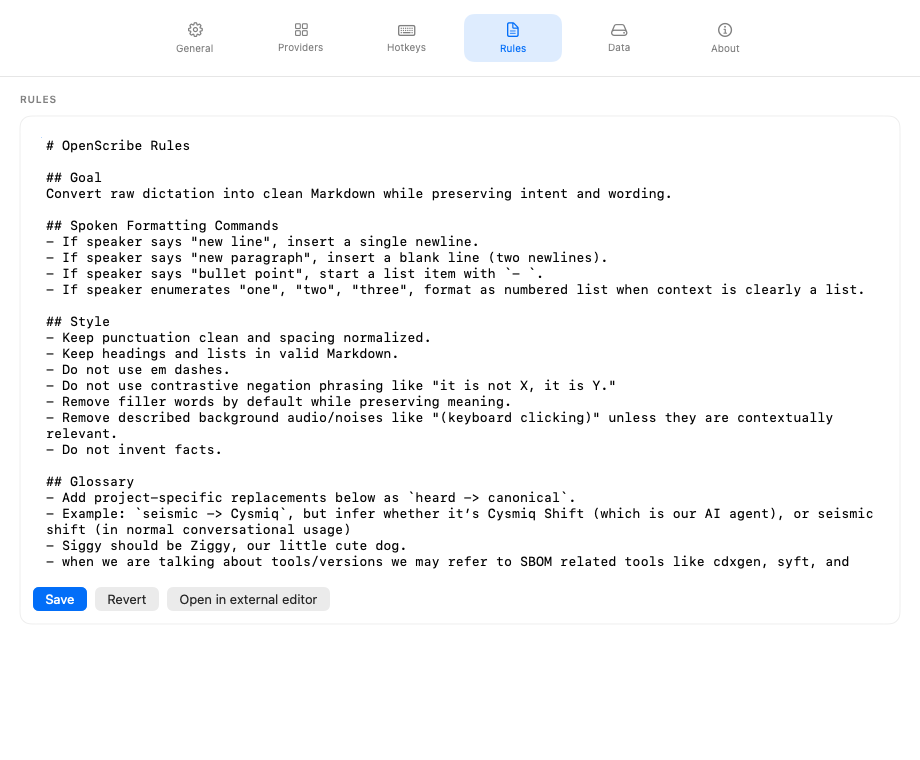

# Custom Rules

Custom rules let you shape how OpenScribe rewrites your transcripts during polish. When polish is enabled, OpenScribe includes your rules file in the prompt sent to the language model.

{ .guide-shot }

## Start simple

The best rules are usually short and specific. Start with the patterns you care about most, run another recording, and then tighten the rules based on the output you get back.

Rules can tell the polish model how you want it to handle writing style, formatting conventions, terminology, and structure. For example, you might add rules to:

- Use British English spelling.
- Format lists with dashes instead of bullets.
- Preserve technical terms without paraphrasing.
- Keep paragraphs short.

## Edit rules in the app

Open Settings > Rules to edit your rules directly in OpenScribe. The Rules tab gives you a text editor plus the actions you need to keep the file under control:

- **Save** writes changes to disk.
- **Revert** discards unsaved edits and reloads the current file.
- **Open in editor** opens the file in your preferred external markdown editor.

You can also jump to the Rules tab with the rules hotkey, `Ctrl + Option + R` by default.

## Where the file lives

Your rules are stored in a single markdown file:

```
~/Library/Application Support/OpenScribe/Rules/rules.md
```

OpenScribe creates this file on first launch with sensible defaults.

## Rules history

OpenScribe keeps a history of rule changes in `Rules/rules.history.jsonl`. Each save appends a timestamped entry so you can track how your rules evolved.

## Continue

- How polish fits in the pipeline: [How It Works](how-it-works.md)
- Provider and model selection: [Providers and Models](providers.md)
- Full settings reference: [UI Reference](../reference/ui-reference.md)
- Where all your data lives: [Your Data](your-data.md)
