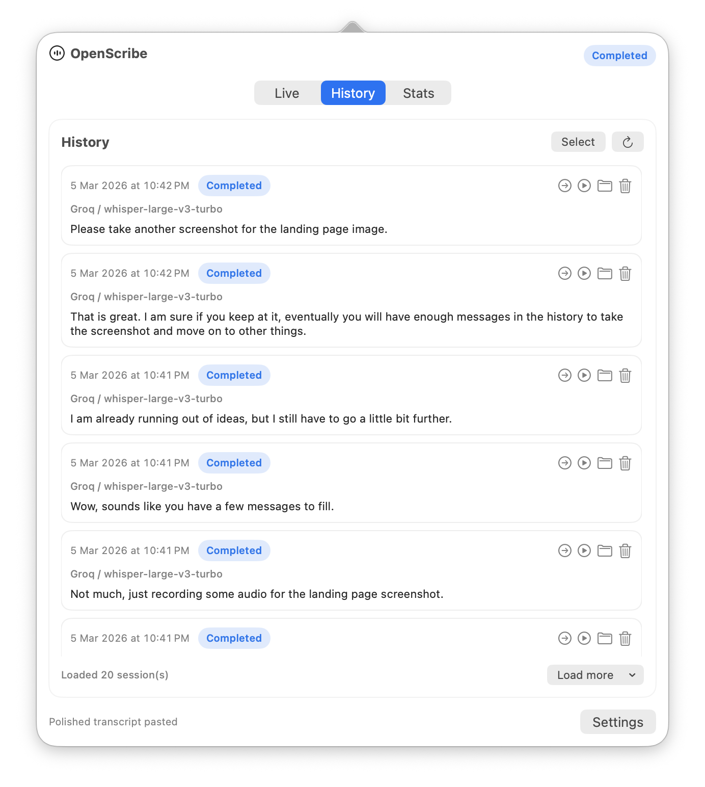
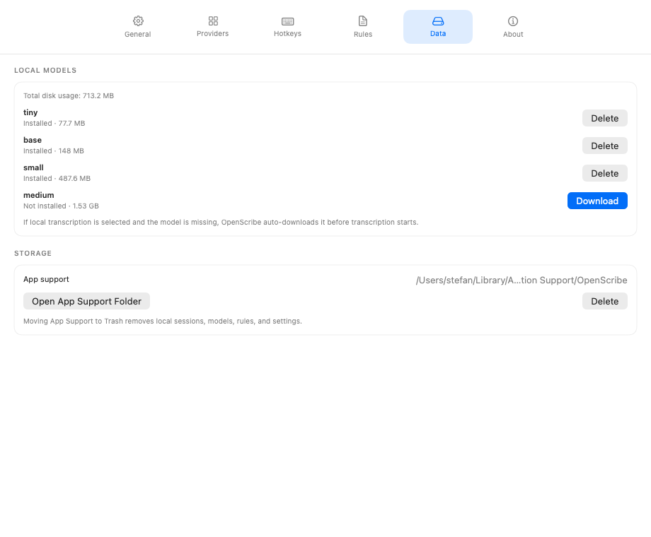

# Your Data

OpenScribe stores its working files locally on your Mac. Nothing is synced anywhere unless you explicitly choose a cloud provider for transcription or polish.

## Find what you need from the app

If you want to revisit a past session, start in the History tab. Each row can replay the recording, re-run processing, or reveal the session folder in Finder.

{ .guide-shot }

If you want the top-level app folder, model management, or cleanup actions, open Settings > Data.

{ .guide-shot }

## Where data lives

All app data lives under:

```
~/Library/Application Support/OpenScribe/
```

You can open this folder directly from Settings > Data.

## Session recordings

Each recording session gets its own folder, organized by date:

```
Recordings/
  2026-03-06/
    143052-<session-id>/
      audio.m4a        -- your recording
      session.json     -- session metadata (provider, model, timestamps)
      raw.txt          -- raw transcript from speech-to-text
      polished.md      -- polished output from the language model
```

Every session keeps all four files, so you can replay audio, re-read transcripts, or re-process with different settings at any time.

## Other data

- **Rules/rules.md** -- your custom polish rules.
- **Rules/rules.history.jsonl** -- timestamped history of rule edits.
- **Stats/usage.events.jsonl** -- usage metrics (session counts, durations, provider usage).
- **Models/whisper/** -- downloaded local transcription models.
- **Config/settings.json** -- app preferences.

## Managing storage

Use Settings > Data to install or delete whisper models and check their disk usage.

Use the History tab when you want to delete specific sessions while keeping the rest of your archive intact.

If you want to remove everything, Settings > Data includes an option to move all app data to Trash.

## Technical details

For the full file layout specification, see the [Storage Contract](../reference/storage-contract.md).

## Continue

- How recordings are created: [How It Works](how-it-works.md)
- Custom polish rules: [Custom Rules](custom-rules.md)
- Full settings reference: [UI Reference](../reference/ui-reference.md)
